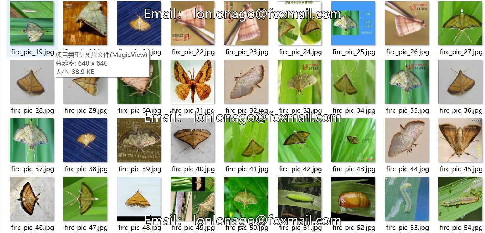
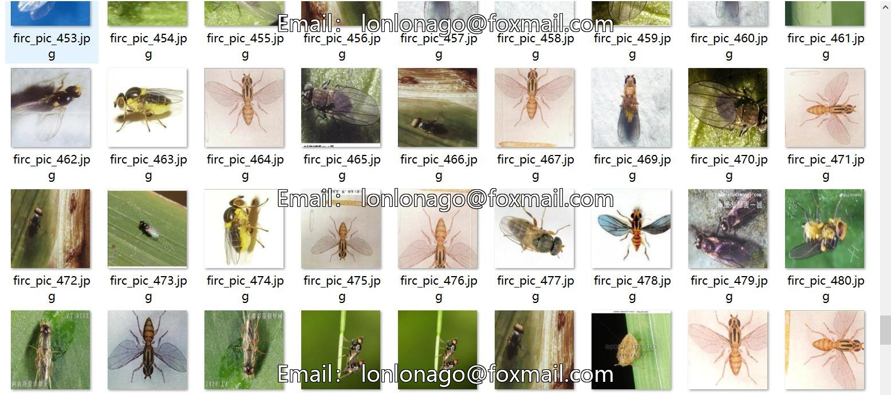
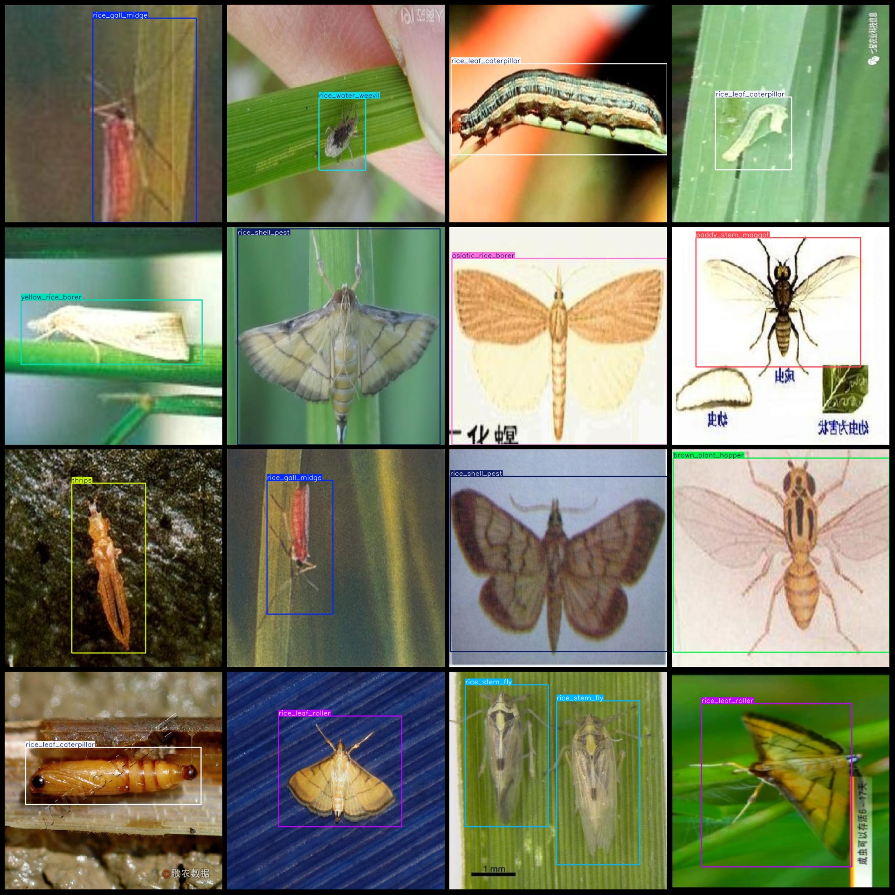
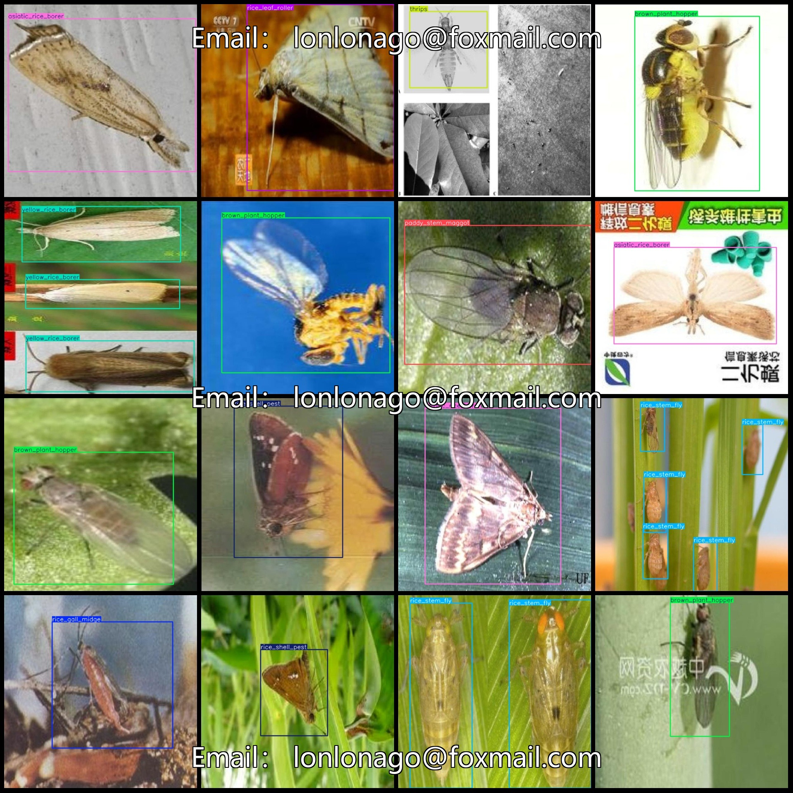

# Intelligent Agriculture Rice Pest Detection Dataset VOC+YOLO with 615 Images and 12 Classes

The dataset format is Pascal VOC format + YOLO format (txt file without split path, only including jpg images and corresponding VOC formatxml files and yolo formattxt files).
number of images: 615  
annotation count: 615  
annotation count: 615  
annotationnumber of classes: 12  
["Asian rice borer", "Brown plant hopper", "Paddy stem maggot", "Rice gall midge", "Rice leaf caterpillar", "Rice leaf hopper", "Rice leaf roller", "Rice shell pest", "Rice stem fly", "Rice water weevil", "Thrips", "Yellow rice borer"]
boxes per class:   
Asian Rice Borer (73 cases)
Brown Plant Hopper (81 cases)
Paddy Stem Maggot (41 cases)
Rice Gall Midge (58 cases)
Rice Leaf Caterpillar (66 cases)
Rice Leaf Hopper (63 cases)
Rice Leaf Roller (56 cases)
Rice Shell Pest (63 cases)
Rice Stem Fly (84 cases)
Rice Water Weevil (65 cases)
Thrips (72 cases)
Yellow Rice Borer (52 cases)
total boxes: 774  
images per class:   
Asian Rice Borer images = 61  
Brown Plant Hopper images = 77  
Paddy Stem Maggot images = 41  
Rice Gall Midge images = 43  
Rice Leaf Caterpillar images = 65  
Rice Leaf Hopper images = 41  
Rice Leaf Roller images = 50  
Rice Shell Pest images = 57  
Rice Stem Fly images = 31  
Rice Water Weevil images = 54  
Thrips images = 55  
Yellow Rice Borer images = 40
image resolution: 640x640  
Use annotation tool: labelImg
Annotation rules: draw a rectangle box around the class
Important notes: The dataset does not include a division of training, validation, and test sets; you need to divide it yourself.
Special statement: This dataset does not guarantee any accuracy for models or weight files trained on it.
Image preview:
## Images

Here is a pay link on Stripe ( https://buy.stripe.com/3cs8yP7sY87d0vu9AB ). Please contact me lonlonago@foxmail.com after funding $89, and I will send you a complete data files , thank you!

